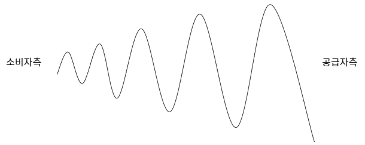
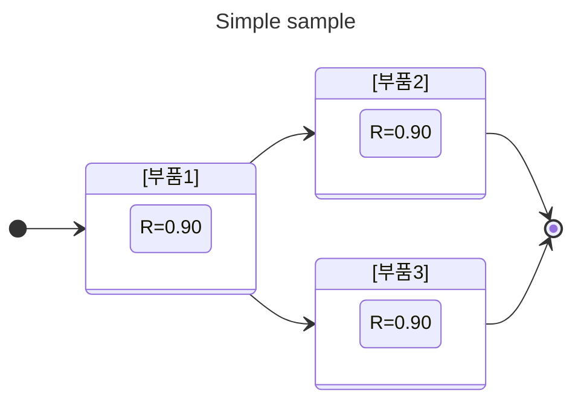

<style>
body {
    margin-left: 50px;  /* 왼쪽 여백 50px */
    margin-right: 50px; /* 오른쪽 여백 50px */
    padding: 20px;      /* 내부 여백 */
}
.page {
    padding-left: 100px; /* 페이지 내부 왼쪽 여백 */
}


"markdown-pdf.headerTemplate": "<div style='font-size: 9px; margin-left: 1cm;'></div>",
    "markdown-pdf.footerTemplate": "<div style='font-size: 9px; margin: 0 auto;'><span class='pageNumber'></span> / <span class='totalPages'></span></div>",
    "markdown-pdf.margin.top": "2cm",
    "markdown-pdf.margin.bottom": "2cm",
    "markdown-pdf.margin.right": "2cm",
    "markdown-pdf.margin.left": "2cm"


</style>

<script type="module">
      import mermaid from 'https://cdn.jsdelivr.net/npm/mermaid@10/dist/mermaid.esm.min.mjs';
      mermaid.initialize({ startOnLoad: true });
</script>

<svg xmlns="http://www.w3.org/2000/svg" viewBox="0 0 600 800">
    <!-- 배경 -->
    <rect fill="#ffffff"/>
    <rect x="0" y="0" width="600" height="800" fill="#1a3c6e"/>
    <!-- 장식적 요소 -->
    <path d="M0 100 L600 100" stroke="#gold" stroke-width="2"/>
    <path d="M0 700 L600 700" stroke="#gold" stroke-width="2"/>
    <!-- 제목 -->
    <text x="300" y="200" text-anchor="middle" fill="#ffffff" font-size="48" font-weight="bold">경영지도사 2차</text>
    <text x="300" y="300" text-anchor="middle" fill="#ffffff" font-size="56" font-weight="bold">생산관리</text>
    <text x="300" y="400" text-anchor="middle" fill="#ffffff" font-size="40" font-weight="bold">2024년 기출 문제</text>
    <!-- 부제 -->
    <text x="300" y="500" text-anchor="middle" fill="#ffd700" font-size="32">예상 해답</text>
    <!-- 저자명 -->
    <text x="300" y="650" text-anchor="middle" fill="#ffffff" font-size="24">이인성 저</text>
    <!-- 장식적 도형 -->
    <circle cx="260" cy="550" r="5" fill="#ffd700"/>
    <circle cx="280" cy="550" r="5" fill="#ffd700"/>
    <circle cx="300" cy="550" r="5" fill="#ffd700"/>
    <circle cx="320" cy="550" r="5" fill="#ffd700"/>
    <circle cx="340" cy="550" r="5" fill="#ffd700"/>
</svg>

<div class="page"></div>

# 저자 약력
- 소프트웨어 분야에서 개발 및 PM 경력
- 자동화 설비업체에서 프로세스 개선 내부 컨설팅 경력
- IITP 평가위원, NIPA 평가위원
- 경영지도사 생산관리분야

# 교재 활용 방법
- **하드카피**로 출력하여 공부하는 경우 문제와 예상 해답을 따로 따로 볼 수 있도록 문제와 예상 해답은 모두 페이지 구분을 해 놓았습니다.
- **소프트카피**로 보는 경우 파랑색으로 보이는 모든 문구는 링크이며 클릭하면 해당 위치로 이동합니다.

<div class="page"></div>

# <div align="center"> 목차 </div>
## 39회 생산관리
- [[문제1]경제적 주문량](#39회-생산관리-문제-1)
- [[문제2]PERT 네트워크](#39회-생산관리-문제-2)
- [[문제3]서비스 설계](#39회-생산관리-문제-3)
- [[문제4]생산량???](#39회-생산관리-문제-4)
- [[문제5]JIT와 MRP 생산방식을 항목별로 비교](#39회-생산관리-문제-5)
- [[문제6]공급사슬의 채찍효과](#39회-생산관리-문제-6)
## 39회 품질경영
- [[문제1]경제적 주문량](#39회-품질경영-문제-1)
- [[문제2]PERT 네트워크](#39회-품질경영-문제-2)
- [[문제3]서비스 설계](#39회-품질경영-문제-3)
- [[문제4]생산량???](#39회-품질경영-문제-4)
- [[문제5]JIT와 MRP 생산방식을 항목별로 비교](#39회-품질경영-문제-5)
- [[문제6]공급사슬의 채찍효과](#39회-품질경영-문제-6)
## 39회 경영과학
- [[문제1]경제적 주문량](#39회-경영과학-문제-1)
- [[문제2]PERT 네트워크](#39회-경영과학-문제-2)
- [[문제3]서비스 설계](#39회-경영과학-문제-3)
- [[문제4]생산량???](#39회-경영과학-문제-4)
- [[문제5]JIT와 MRP 생산방식을 항목별로 비교](#39회-경영과학-문제-5)
- [[문제6]공급사슬의 채찍효과](#39회-경영과학-문제-6)

<div class="page"></div>

<a id="39회_생산관리분야"></a>

# <div align="center"> 생산관리 </div>

<a id="39회_생산관리"></a>

<a id="39회_생산관리_문제1"></a>
## 39회 생산관리 문제 1
### 단독 공급자(제조업체)와 단독 구매자(소매상)로 구성된 2단계 공급사슬에관한 설명이다. 다음 물음에 답하시오. (30점)

```
제조업체는 전통적으로 제품을 1,000원/개에 판매하여 왔으나 다음과 같은 새로운
가격정책을 실시하려고 계획한다. 공급자와 구매자 사이에 거래되는 제품은 하나이고, 제품의 주당 평균 수요는 30개이다.
    
    가격정책 1:
    구매자가 매주 주문을 하는 경우에는 제품을 950원/개에 판매하는 정책

    가격정책 2:
    구매자가 매분기 주문을 하는 경우에는 기준가격 1,000원/개에서 9%를 할인하여 주는 정책

구매자가 제품을 주문한 후 배달되는데 걸리는 시간은 1주일이며, 구매자가 가격정책에 따라 매주(혹은 분기) 끝나는 시점에 재고를 확인해보면 평균적으로 한 주 수요량의 재고가 있다고 가정한다. 주당 재고유지 비용은 재고가치의 0.4%이고 1년은 52주로 가정한다.
```

(1) 구매자가 가격정책 1을 선택한다고 가정할 때, 구매자의 평균 주문량, 연간구매비용의 기댓값, 그리고 연간 재고 유지비용의 기댓값을 구하시오. (13점)

(2) 구매자가 가격정책 2를 선택하고 할인된 가격에만 구매를 한다고 가정할 때, 구매자의 평균 주문량, 연간 구매비용의 기댓값, 그리고 연간 재고 유지비용의 기댓값을 구하시오. (13점)

(3) 구매자의 총비용(연간 구매 및 재고 유지비의 합)이 적은 가격 정책을 기술하시오. (4점)

[예상 답안 바로가기](#39회-생산관리-문제-1-예상답안)

[목차 바로가기](#39회-생산관리-목차)

<div class="page"></div>

## 39회 생산관리 문제 1 예상답안

### 【문제 요약】 [문제보기](#39회-생산관리-문제-1)
* 주어진 조건
    * 제품의 주당 평균 수요 (DDD): 30개
    * 배달 시간: 1주일
    * 재고 유지 비용: 재고 가치의 0.4% 주당
    * 1년은 52주
    * 매주 혹은 분기 말에 평균적으로 한 주 수요량의 재고가 존재함.
* 가격정책 1 (매주 주문)
    * 제품 가격: 950원/개
* 가격정책 2 (매분기 주문)
    * 기준 가격: 1,000원/개
    * 할인율: 9%
    * 할인된 가격: 1000 × ( 1 − 0.09 ) = 910원/개

### 【문제 1 - (1)】 가격정책 1: 매주 주문
1. 평균 주문량 (Q):
  Q = D = 30개
2. 연간 구매 비용 (C1​):
  C1 = D × P1 × 52 = 30 × 950 × 52 = 1,482,000 원
3. 연간 재고 유지 비용 (H1​):
  * 매주 말 평균 재고: 한 주 수요량 (D)
    평균 재고 = D = 30개
  * 주당 재고 유지 비용:
    주당 재고 유지 비용 = 평균 재고 × P1 × 0.004 = 30 × 950 × 0.004 = 114 원
  * 연간 재고 유지 비용:
    H1 = 114 × 52 = 5,928 원
    
### 【문제 1 - (2)】 가격정책 2: 매분기 주문
- 평균 주문량 (Q):
Q = D × 13 = 30 × 13 = 390 개
- 연간 구매 비용 (C2​):
C2 = D × P2 × 52 = 30 × 910 × 52 = 1,418,400 원
- 연간 재고 유지 비용 (H2​):
  - 매분기 말 평균 재고: 한 주 수요량 (D)
  - 평균 재고 = D = 30 개
  - 주당 재고 유지 비용:
  - 주당 재고 유지 비용 = 평균 재고 × P2 × 0.004 = 30 × 910 × 0.004 = 109.2 원
  - 연간  재고 유지 비용:
H2 = 109.2 × 52 = 5,678.4 원

### 【문제 1 - (3)】 총비용 비교
각 가격정책의 총비용을 계산합니다.
- 가격정책 1의 총비용:
총비용1 = C1 + H1 = 1,482,000 + 5,928 = 1,487,928 원
- 가격정책 2의 총비용:
총비용2 = C2 + H2 = 1,418,400 + 5,678.4 = 1,424,078.4 원
- 결론
  - 구매자의 총비용이 적은 가격정책은 가격정책 2입니다.
  - 따라서 구매자는 가격정책 2를 선택하는 것이 더 비용 효율적입니다.

[목차 바로가기](#39회-생산관리-목차)

----

<div class="page"></div>

----

## 39회 생산관리 문제 2
### 다음 그림은 어떤 과업에 대한 PERT 네트워크를 작성한 것이다. 과업을구성하는 7개의 세부 활동에 대한 사항은 아래의 표와 같을 때 각물음에답하시오. (단, 소수점 셋째자리에서 반올림하여 소수점 둘째자리까지구한다.) (30점)

<table align=center style="text-align:center;", border=1>
  <tr align=center, bgcolor="#D3D3D3"> <th rowspan="2">번호</th><th rowspan="2">활동</th><th rowspan="2">선행활동</th><th colspan="3"><center>소요시간(단위: 일)</center></th> </tr>
  <tr align=center, bgcolor="#D3D3D3"> <th>낙관적 시간</th><th>최빈 시간</th><th>비관적 시간</th> </tr>
  <tr align=center> <td>1</td> <td>A</td> <td>-</td> <td>4</td> <td>5</td> <td>8</td> </tr>
  <tr align=center> <td>2</td> <td>B</td> <td>A</td> <td>3</td> <td>6</td> <td>9</td> </tr>
  <tr align=center> <td>3</td> <td>C</td> <td>A</td> <td>4</td> <td>7</td> <td>10</td> </tr>
  <tr align=center> <td>4</td> <td>D</td> <td>B, C</td> <td>2</td> <td>5</td> <td>8</td> </tr>
  <tr align=center> <td>5</td> <td>E</td> <td>B, D</td> <td>2</td> <td>4</td> <td>8</td> </tr>
  <tr align=center> <td>6</td> <td>F</td> <td>C</td> <td>4</td> <td>7</td> <td>10</td> </tr>
  <tr align=center> <td>7</td> <td>G</td> <td>E, F</td> <td>2</td> <td>3</td> <td>6</td> </tr>
</table>

(*) 표준정규분포표, $\phi(z) = P(Z<z)$

<table align="center", border=1>
  <tr align=center, bgcolor="#D3D3D3"><th>z</th><th>0.0</th><th>0.5</th><th>1.0</th><th>1.5</th><th>2.0</th><th>2.5</th><th>3.0</th></tr>
  <tr><td>$\phi$(z)</td><td>0.5000</td><td>0.6915</td><td>0.8413</td><td>0.9332</td><td>0.9772</td><td>0.9938</td><td>0.9987</td></tr>
</table>

(1) 주경로와 과업 소요시간의 기댓값 및 분산을 구하시오. (20점)

(2) 이 과업이 28일 이내에 완료될 확률을 정규분포를 가정하여 구하시오. (단, 위에 주어진 표준정규분포표를 참고하되 필요할 경우 근사치를 이용하시오.) (5점)

(3) 추가 비용을 투입하여 활동 C와 D의 소요시간을 절반씩 단축시킬 수 있다고한다. 이 때 단축되는 과업 소요시간의 기댓값을 구하시오. (5점)

[예상 답안 바로가기](#39회-생산관리-문제-2-예상답안)

[목차 바로가기](#39회-생산관리-목차)

----

<div class="page"></div>

----

## 39회 생산관리 문제 2 예상답안

### 생산관리 【문제 2 - 1】 주경로와 과업 소요시간의 기댓값과 분산 [문제보기](#39회-생산관리-문제-2)

<table style="text-align:center;" align="center", border=1>
  <tr bgcolor="#D3D3D3"> <th>번호</th> <th>활동</th> <th>선행활동</th> <th>낙관적 시간 (a)</th> <th>최빈 시간 (m)</th> <th>비관적 시간 (b)</th> <th>기댓값 (TE)</th> <th>분산 (V)</th> </tr>
  <tr> <td>1</td> <td>A</td> <td>-</td> <td>4</td> <td>5</td> <td>8</td> <td>5.33</td> <td>0.444</td> </tr>
  <tr> <td>2</td> <td>B</td> <td>A</td> <td>3</td> <td>6</td> <td>9</td> <td>6.00</td> <td>1.000</td> </tr>
  <tr> <td>3</td> <td>C</td> <td>A</td> <td>4</td> <td>7</td> <td>10</td> <td>7.00</td> <td>1.000</td> </tr>
  <tr> <td>4</td> <td>D</td> <td>B, C</td> <td>2</td> <td>5</td> <td>8</td> <td>5.00</td> <td>1.000</td> </tr>
  <tr> <td>5</td> <td>E</td> <td>B, D</td> <td>2</td> <td>4</td> <td>8</td> <td>4.33</td> <td>1.000</td> </tr>
  <tr> <td>6</td> <td>F</td> <td>C</td> <td>4</td> <td>7</td> <td>10</td> <td>7.00</td> <td>1.000</td> </tr>
  <tr> <td>7</td> <td>G</td> <td>E, F</td> <td>2</td> <td>3</td> <td>6</td> <td>3.33</td> <td>0.444</td> </tr>
</table>

#### 주경로 기댓값과 분산 계산
* 주경로 A -> C -> D -> E -> G:
* 기댓값 = 5.33 + 7 + 5 + 4.33 + 3.33 = 24.99
* 분산 = 0.444 + 1 + 1 + 1 + 0.444 = 3.888

#### 주경로 결정
* 주경로 A -> C -> D -> E -> G
* 기댓값 24.99일
* 분산 3.89

### 생산관리 【문제 2 - 2】 이 과업이 28일 이내에 완료될 확률
* 표준편차 =  $\sqrt{3.89} ≈ 1.97$

* $Z$-값 계산 = $Z$ = <span style="font-size:135%"> $\frac{28-24.99}{1.97}$ </span> $≈ 1.53$
* $Z$ = 1.53의 정규분포 값은 약 0.9332 따라서, 이 과업이 28일 이내에 완료될 확률은 약 93.32%입니다.

### 생산관리 【문제 2 - 3】 활동 C와 D의 소요시간을 절반씩 단축했을 때

C와 D의 소요시간을 절반으로 줄인 후의 기댓값과 분산은:
활동 C
* 새로운 기댓값 = $\frac{(4+4×3.5+5)}{6}$ = 3.83

* 새로운 분산 = $(\frac{5-2}{6})^2$ = 0.25

활동 D
* 새로운 기댓값 = (2+4×2.5+4) / 6 = 5.33

* 새로운 분산 =  $(\frac{4-2}{6})^2$ = 0.11

단축된 주경로의 기댓값
* 기존의 주경로 A -> C -> D -> E -> G의 기댓값은 21.00인데
* 주경로는 A -> B -> D -> E -> G의 기댓값은 22.33으로 주경로가 변경됩니다.
* 새로운 경로 기댓값: 5.33 + 6.00 + 3.33 + 4.33 + 3.33 = 22.33
   따라서 단축된 과업 소요시간의 기댓값은 22.33일 입니다.


[목차 바로가기](#39회-생산관리-목차)

----

<div class="page"></div>

----

<a id="39회_생산관리_문제3"></a>

## 【문제 3】

### 현장 서비스 전달을 위한 서비스 설계와 관련하여 다음 물음에 답하시오. (10점)

(1) 서비스 설계의 유형을 2가지만 쓰고, 각각 설명하시오. (6점)

(2) 서비스 청사진과 가시선 경계에 대해 각각 설명하시오. (4점)

[(예시답안)](./예시답안.md#39회_생산관리_문제3_예시답안)

### 생산관리 【문제 3 - (1)】 서비스 설계 유형 2가지

* 제품 중심 설계 (Product-Centered Design) : 제품 중심 설계는 서비스의 핵심 제품이나 주된 제공물에 초점을 맞추는 접근 방식입니다. 이 접근 방식은 제품 자체의 품질, 기능성, 디자인 등을 최적화하는 것을 목표로 합니다. 예를 들어, 식당의 음식 메뉴가 이 유형에 해당합니다. 메뉴의 구성, 맛, 제공되는 음식의 품질 등이 주된 설계 요소입니다. 이는 고객이 주로 제품을 통해 경험하는 서비스의 질을 결정짓기 때문입니다.
* 고객 중심 설계 (Customer-Centered Design) : 고객 중심 설계는 고객의 필요와 기대에 맞춰 서비스를 설계하는 접근 방식입니다. 이 방법은 고객의 경험과 만족도를 최우선으로 고려합니다. 예를 들어, 병원의 환자 대기 시스템이 이 유형에 해당할 수 있습니다. 환자가 대기하는 동안의 편의성, 정보 제공, 대기 시간의 관리 등이 주요 설계 요소입니다. 이 설계는 서비스 제공의 전 과정을 고객의 관점에서 최적화하여 높은 만족도를 이끌어내고자 합니다.

### 생산관리 【문제 3 - (2)】 서비스 청사진과 가시선 경계

* 서비스 청사진 (Service Blueprint) : 서비스 청사진은 서비스 전달 과정을 시각적으로 나타낸 도구입니다. 이는 고객의 경험을 중심으로 서비스의 각 단계를 상세하게 도식화하여 서비스 제공 과정의 명확한 이해를 돕습니다. 서비스 청사진은 일반적으로 고객 행동, 프런트 스테이지와 백 스테이지 활동, 지원 프로세스 등을 포함합니다. 이를 통해 서비스 제공의 병목 지점, 문제 영역, 개선 기회를 쉽게 파악할 수 있습니다. 예를 들어, 레스토랑의 서비스 청사진은 예약, 주문, 식사, 결제 등 모든 과정을 도식화하여 서비스 흐름을 시각적으로 나타냅니다.
* 가시선 경계 (Line of Visibility) : 가시선 경계는 고객이 직접 경험하고 인식할 수 있는 서비스 요소와 그렇지 않은 요소를 구분하는 선입니다. 이 경계는 서비스 청사진 내에서 고객에게 보이는 부분(프런트 스테이지)과 보이지 않는 부분(백 스테이지)을 구별합니다. 가시선 경계를 설정하면 서비스 제공자와 고객 간의 상호작용을 명확히 하고, 직원이 고객의 기대를 충족시키기 위해 어떤 활동을 해야 하는지 알 수 있게 됩니다. 예를 들어, 호텔의 프런트 데스크는 고객에게 보이는 영역(프런트 스테이지)이지만, 호텔의 예약 처리 시스템은 고객에게 보이지 않는 영역(백 스테이지)입니다.

----

<div class="page"></div>

----

<a id="39회_생산관리_문제4"></a>
### 【문제 4】 4가지 단계(자원)로 구성된 생산 프로세스에 관하여 다음 물음에 답하시오. (단, 하루 8시간 작업한다고 가정한다.) (10점)

<div align=center>
<table align=center, border=1>
  <tr align=center, bgcolor="#D3D3D3"> <th>단계(자원)</th> <th>처리시간(분/단위)</th> </tr>
  <tr align=center> <td>1</td> <td>1</td> </tr>
  <tr align=center> <td>2</td> <td>3</td> </tr>
  <tr align=center> <td>3</td> <td>4</td> </tr>
  <tr align=center> <td>4</td> <td>2</td> </tr>
</table>
</div>

(1) 현 생산 프로세스의 일 최대 생산량을 구하시오. (4점)

(2) 현 생산 프로세스에서 1단계 처리시간을 1분에서 2분으로 늘리고, 2단계 처리시간을3분에서 2분으로 줄였을 때, 생산 프로세스의 생산량 변화를 설명하시오. (3점)

(3) 현 생산 프로세스에서 4단계 처리시간을 2분에서 3분으로 늘리고, 3단계 처리시간을4분에서 3분으로 줄였을 때, 생산 프로세스의 생산량 변화를 설명하시오. (3점)

[(예시답안)](./예시답안.md#39회_생산관리_문제4_예시답안)

### 생산관리 【문제 4 - (1)】 일 최대 생산량: 

가장 시간이 많이 걸리는 단계는 3단계(4분)입니다. 따라서 일 최대 생산량은 다음과 같이 계산됩니다.

일 최대 생산량 = <span style="font-size:135%"> $\frac{480분}{4분}$ </span> = 120단위

### 생산관리 【문제 4 - (2)】 1단계를 2분으로 늘리고, 2단계를 2분으로 줄였을 때 생산량 변화

여전히 가장 시간이 많이 걸리는 단계는 3단계(4분)입니다. 따라서 일 최대 생산량은 변경되지 않습니다.

일 최대 생산량 = <span style="font-size:135%"> $\frac{480분}{4분}$ </span> = $120단위$

### 생산관리 【문제 4 - (3)】 4단계를 2분에서 3분으로 늘리고 3단계를 4분에서 3분으로 줄였을 때 생산량 변화

이 경우, 가장 시간이 많이 걸리는 단계는 1단계, 2단계와 3단계 (각각 3분)입니다. 따라서 새로운 일 최대 생산량은 3분을 기준으로 계산합니다.

일 최대 생산량 = <span style="font-size:135%"> $\frac{480분}{3분}$ </span> $​= 160단위$

----

<div class="page"></div>

----

<a id="39회_생산관리_문제5"></a>

### 【문제 5】 아래 표는 JIT와 MRP 생산방식을 항목별로 비교한 것이다. ①∼⑩에타당한 내용을 ‘비고’에서 선택하여 쓰시오. (10점)

<table align=center, border=1>
  <tr bgcolor="#D3D3D3"> <th>비교항목</th> <th>JIT</th> <th>MRP</th> <th>비고</th> </tr>
  <tr> <td>시스템</td> <td>①</td> <td>②</td> <td>Push, Pull</td> </tr>
  <tr> <td>관리목표</td> <td>③</td> <td>④</td> <td>계획 및 통제, 낭비제거</td> </tr>
  <tr> <td>공급자 관계</td> <td>⑤</td> <td>⑥</td> <td>장기적, 단기적</td> </tr>
  <tr> <td>로트크기(Lot Size)</td> <td>⑦</td> <td>⑧</td> <td>최소량, EOQ</td> </tr>
  <tr> <td>품질</td> <td>⑨</td> <td>⑩</td> <td>무결점 추구, 불량인정</td> </tr>
</table>

----

<div class="page"></div>

----

[(예시답안)](./예시답안.md#39회_생산관리_문제5_예시답안)

<table align="center", border=1>
  <tr bgcolor="#D3D3D3"> <th>비교항목</th> <th>JIT</th> <th>MRP</th> <th>비고</th> </tr>
  <tr> <td>시스템</td> <td>① Pull</td> <td>② Push</td> <td>Push, Pull</td> </tr>
  <tr> <td>관리목표</td> <td>③ 낭비제거</td> <td>④ 계획 및 통제</td> <td>계획 및 통제, 낭비제거</td> </tr>
  <tr> <td>공급자 관계</td> <td>⑤ 장기적</td> <td>⑥ 단기적</td> <td>장기적, 단기적</td> </tr>
  <tr> <td>로트크기(Lot Size)</td> <td>⑦ 최소량</td> <td>⑧ EOQ</td> <td>최소량, EOQ</td> </tr>
  <tr> <td>품질</td> <td>⑨ 무결점 추구</td> <td>⑩ 불량인정</td> <td>무결점 추구, 불량인정</td> </tr>
</table>

----

<div class="page"></div>

----

<a id="39회_생산관리_문제6"></a>

### 【문제 6】공급사슬의 채찍효과에 관하여 다음 물음에 답하시오. (10점)

(1) 채찍효과를 설명하고 그림으로 묘사하시오. (4점)

(2) 채찍효과가 나타나는 원인을 3가지만 제시하시오. (3점)

(3) 채찍효과에 대처하는 방안을 3가지만 제시하시오. (3점)

----

<div class="page"></div>

----

[(예시답안)](./예시답안.md#39회_생산관리_문제6_예시답안)

### 생산관리 【문제 6 - (1)】 채찍효과(Bullwhip Effect)는 공급망에서 작은 수요 변동이 상위 단계로 갈수록 점점 더 큰 변동으로 증폭되는 현상을 말합니다.



### 생산관리 【문제 6 - (2)】 채찍 효과가 나타나는 원인 3가지
1. 수요 예측 오류
2. 주문 배치 (Order Batching)
3. 가격 변동과 프로모션

### 생산관리 【문제 6 - (3)】 채찍 효과에 대처하는 방안 3가지
1. 실시간 정보 공유
2. 공동 수요 예측
3. Vendor Managed Inventory
4. 리드타임 단축

----

<div class="page"></div>

----

<a id="39회_품질경영"></a>

# <div align="center"> 품질경영 </div>

----

<a id="39회_품질경영_문제1"></a>
## 【문제 1】

### 서비스품질에 관하여 다음 물음에 답하시오. (30점)

 (1) 서비스품질의 평가(결정)요소 10가지에 대해 설명하시오. (10점)

 (2)SERVQUAL의 5개 차원과 각 차원의 정의를 쓰시오. (10점)

 (3)서비스품질의 평가요소 10가지를 SERVQUAL의 5개 차원으로 분류하여쓰시오. (10점)

[(예시답안)](./예시답안.md#39회_품질경영_문제1_예시답안)

<a id="39회_품질경영_문제2"></a>
### 【문제 2】 A기업에서 생산하는 제품의 직경 규격은 3±0.12 cm이다. 직경평균은3.02 cm이고 직경 표준편차는 0.04 cm라고 할 때, 다음 물음에 답하시오. (단, 소수점 셋째자리에서 반올림하여 소수점 둘째자리까지 구한다.) (30점)

 (1) 공정상한(USL)과 공정하한(LSL)을 각각 구하시오. (6점)

 (2)공정능력지수(Cp)와 실제 공정능력지수(Cpk)를 각각 구하시오. (12점)

 (3)직경 표준편차를 0.02 cm로 개선한 경우, 공정능력지수(Cp)와 실제 공정능력지수(Cpk)를 각각 구하시오. (12점)

[(예시답안)](./예시답안.md#39회_품질경영_문제2_예시답안)

----

<a id="39회_품질경영_문제3"></a>
### 【문제 3】 품질경영에 관하여 다음 물음에 답하시오. (10점) 

 (1) 가빈(D. Garvin)의 8가지 품질 차원(특성)에 대해 설명하시오. (5점)

 (2) KS Q ISO 9000 : 2015에서 제시하고 있는 품질경영 실현을 위한 7가지원칙에대해 설명하시오. (5점)

[(예시답안)](./예시답안.md#39회_품질경영_문제3_예시답안)

----

<a id="39회_품질경영_문제4"></a>
### 【문제 4】 신뢰성에 관하여 다음 물음에 답하시오. (단, 소수점 셋째자리에서 반올림하여 소수점 둘째자리까지 구한다.) (10점)

 (1) A제품은 다음과 같이 2개 부품의 직렬배열로 구성된다. 각 부품의 신뢰성이0.90일 때, A제품의 신뢰성을 구하시오. (5점)

```{.mermaid format=svg}
stateDiagram
    [*] --> First
    state First {
        [*] --> second
        second --> [*]
    }
```


```{.mermaid format=svg}
---
title: Simple sample
---
stateDiagram
    direction LR
    [*] --> [부품1]
    state [부품1] {
      direction LR
      a : R=0.90
    }
    state [부품2] {
      direction LR
      b: R=0.90
    }
    [부품1] --> [부품2]
    [부품2] --> [*]
```

 (2) A제품의 신뢰성을 제고하기 위해 다음과 같이 부품2를 병렬 배치하였다. 각부품의 신뢰성이 0.90일 때, A제품의 신뢰성을 구하시오. (5점)




 [(예시답안)](./예시답안.md#39회_품질경영_문제4_예시답안)

----

<a id="39회_품질경영_문제5"></a>
### 【문제 5】품질비용(quality cost)에 관하여 다음 물음에 답하시오. (10점)

 (1) 품질비용의 정의를 기술하시오. (3점)

 (2) 1:10:100 원칙(법칙)에 대해 설명하시오. (3점)

 (3) 품질비용을 구성하는 4가지 비용에 대해 설명하시오. (4점)

 [(예시답안)](./예시답안.md#39회_품질경영_문제5_예시답안)

----

<a id="39회_품질경영_문제6"></a>
### 【문제 6】 샘플링검사에 관하여 다음 물음에 답하시오. (10점)

 (1) 생산자위험에 대해 설명하시오. (5점)

 (2) 소비자위험에 대해 설명하시오. (5점)

[(예시답안)](./예시답안.md#39회_품질경영_문제6_예시답안)

----
----

<div style="page-break-after: always;"></div>

<a id="39회_경영과학"></a>

# 경영과학
<a id="39회_경영과학_문제1"></a>
### 【문제 1】 최근 여유자금 10억 원이 생긴 a씨는 다음 4 가지 투자 대안을 고민하다가 두 명의 전문가에게 투자자문을 받았다 투자 전문가 비는 유동성 확보를 위해 저축에 대한 투자는 전체 투자금의 30% 이상으로 하고 주식과 선물에 투자금 합은 전체 투자금의 50%를 넘지 않아야 한다고 자문하였으며 투자 전문가 c는 전문가 비의 전문 내용과 동일한 조건을 자문하는 동시에 추가적으로 채권과 선물에 투자금 합은 전체 투자금의 60%를 넘지 않아야 한다고 자문하였다 a씨의 가용한 투자금 제약 조건이 10억 원인 상황에서 수익을 최대화하기 위한 투자계획 문제에 대해 다음 물음에 답하시오. (30점)

<table align=center>
  <tr> <th style="text-align:center;">투자 대안</th> <th style="text-align:center;">수익률</th> </tr>
  <tr align=center> <td style="text-align:center;">주식</td> <td align:center>10%</td> </tr>
  <tr align=center> <td style="text-align:center;">채권</td> <td align:center>12%</td> </tr>
  <tr align=center> <td style="text-align:center;">선물</td> <td style="text-align:center;">25%</td> </tr>
  <tr align=center> <td style="text-align:center;">저축</td> <td style="text-align:center;">5%</td> </tr>
</table>

 (1) 전문가 B의 자문 내용을 준수하는 투자계획 문제를 선형계획법 모형으로 제시하시오.(단, 의사결정 변수는 Xi (i=1, 2, 3, 4)로 표시하고 목적함수값은 ZB로 표시할 것) (10점)

 (2) 전문가 C의 자문 내용을 준수하는 투자계획 문제를 선형계획법 모형으로 제시하시오. (단, 의사결정 변수는 Xi (i=1, 2, 3, 4)로 표시하고 목적함수값은 ZC로 표시할 것) (6점)

 (3) (1)과 (2)의 ZB와 ZC 크기를 비교하여 부등식으로 표현하고 그 이유를 설명하시오. (8점)

 (4) (1)의 선형계획법 모형에서 ‘가용한 투자금 제약조건’에 우변 상수 10억 원에 대한 민감도 분석 결과, 쌍대값(잠재가격)이 1,640만원으로 나타났다. 이 값의 의미를 설명하시오. (6점)

[(예시답안)](./예시답안.md#39회_경영과학_문제1_예시답안)

----

<a id="39회_경영과학_문제2"></a>
### 【문제 2】 자동차 부품을 생산하는 K 제조업체는 추가적으로 공장을 집계로 결정하고 여러 장소를 물색하여 세 군데에 공장 입지 후보(A, B, C)를 도출하였다. 입지 선택을 위하여 AHP 방법론을 적용하고자 하는데 세 가지 기준((투자 비용, 물류 효율성, 고객 접근성)을 고려하고 있다. 다음 물음에 답하시오. (단, 계산 과정을 쓰고 모든 계산은 소수점 넷째 자리에서 반올림하여 소수점 셋째자리까지 구한다.) (30점)

 (1) 업체는 세 가지 기준에 대하여 다음과 같은 쌍대비교 행렬표(pairwise comparison matrix)를 도출하였다. 3가지 기준에 대한 상대적 중요도를 구하시오.(15점)

<table>
  <tr> <th>기준</th> <th>투자 비용</th> <th>물류 효율성</th> <th>고객 접근성</th> </tr>
  <tr align=center> <td>투자 비용</td> <td>1</td> <td>1/2</td> <td>4</td> </tr>
  <tr align=center> <td>물류 효율성</td> <td>2</td> <td>1</td> <td>8</td> </tr>
  <tr align=center> <td>고객 접근성</td> <td>1/4</td> <td>1/8</td> <td>1</td> </tr>
</table>

 (2) 위 쌍대비교 행렬표의 일관성을 평가하기 위해 일관성비율(consistency ratio, CR) 값을 계산한 결과 0이 나왔다. 이 수치의 의미를 설명하시오.(5점)

 (3) 업체는 각각의 기준에 대하여 공장 입지 후보에 대한 상대적 선호들을 다음과 같이 도출하였다. 3개 후보의 종합적인 선호도와 순위를 구하시오.(10점)
<table>
  <tr> <th rowspan="2">공장입지 후보</th> <th colspan="3"><center>기준</center></th> </tr>
  <tr> <th>투자비용</th> <th>물류효율성</th> <th>고객접근성</th> </tr>
  <tr align=center> <td>A</td> <td>0.500</td> <td>0.300</td> <td>0.200</td> </tr>
  <tr align=center> <td>B</td> <td>0.150</td> <td>0.050</td> <td>0.700</td> </tr>
  <tr align=center> <td>C</td> <td>0.350</td> <td>0.650</td> <td>0.100</td> </tr>
</table>

[(예시답안)](./예시답안.md#39회_경영과학_문제2_예시답안)

----

<a id="39회_경영과학_문제3"></a>
### 【문제 3】 A 물류센터는 하루(24시간) 동안 각 시간대별로 다음과 같이 최소 아르바이트 인력을 확보할 필요가 있다. 규정상 아르바이트 인력이 근무를 시작하는 시간은 자정, 새벽 4시, 오전 8시, 정오, 오후 4시, 저녁 8시이며 근무를 시작한 이후 8시간 동안 연속 근무를 한다. 예를 들어, 자정에 일을 시작한 아르바이트 인력은 오전 8시까지 근무한다. 이 물류센터에서 각 근무 시간대 아르바이트 인력 확보 조건을 충족하기 위해 고용해야 하는 아르바이트 인력을 최소화하는 문제를 정수 계획법 모형으로 제시하시오. (단, 의사결정 변수는 Xi (i=1, 2, 3, 4, 5, 6)으로 표시할 것) (10점)
<table>
  <tr> <th>근무시간대</th> <th>최소 확보 인력</th> </tr>
  <tr align=center> <td>자정 ~ 새벽 4시</td> <td>4명</td> </tr>
  <tr align=center> <td>새벽 4시 ~ 오전 8시</td> <td>8명</td> </tr>
  <tr align=center> <td>오전 8시 ~ 정오</td> <td>6명</td> </tr>
  <tr align=center> <td>정오 ~ 오후 4시</td> <td>6명</td> </tr>
  <tr align=center> <td>오후 4시 ~ 저녁 8시</td> <td>7명</td> </tr>
  <tr align=center> <td>저녁 8시 ~ 자정</td> <td>5명</td> </tr>
</table>

[(예시답안)](./예시답안.md#39회_경영과학_문제3_예시답안)

----

<a id="39회_경영과학_문제4"></a>
### 【문제 4】 S 슈퍼마켓에는 1대의 계산기가 있다. 이 계산대에는 시간당 평균 48명의 손님이 온다. 계산대에 손님 1명을 계산하는데 걸리는 시간은 평균 1분이다. 다음 물음에 답하시오. (10점)

 (1) 손님이 계산대에 왔을 때 기다리지 않고 발로 계산할 수 있는 확률을 구하시오. (3점)

 (2) 계산을 위해 대기하고 있는 손님의 평균 수를 구하시오. (3점)

 (3) 손님의 평균 대기시간을 구하시오. (4점)

[(예시답안)](./예시답안.md#39회_경영과학_문제4_예시답안)

----

<a id="39회_경영과학_문제5"></a>
### 【문제 5】 아래 수송표에 나타난 수송문제에 관하여 다음 물음에 답하시오. (10점)

<table><center>
  <tr> <th></th> <th>1</th> <th>2</th> <th>3</th> <th>공급량</th> </tr>
  <tr align=center> <td>1</td> <td>3만원</td> <td>5만원</td> <td>7만원</td> <td>150</td> </tr>
  <tr align=center> <td>2</td> <td>8만원</td> <td>4만원</td> <td>6만원</td> <td>130</td> </tr>
  <tr align=center> <td>수요량</td> <td>70</td> <td>80</td> <td>90</td> <td></td> </tr></center>
</table>

 (1) 균형된 수송문제로 변환한 후 수송표를 그려서 제시하시오. (단, 가상수요지 또는 가상공급지는 ‘V’기호로 표시함) (5점)

 (2) 북서코너법(북서모서리법)을 활용하여 구한 초기해의 총 수송비용을 구하시오. (5점)

 [(예시답안)](./예시답안.md#39회_경영과학_문제5_예시답안)

----

<a id="39회_경영과학_문제6"></a>
### 【문제 6】 의사결정에서는 미래에 가능한 상황(낙관적 상황, 중도적 상황, 비관적 상황 등)에 따라 대한불 성과표를 만들고 성격표가 완성되면 의사결정을 내리기 위한 몇 가지 기준을 고려할 수 있다 의사결정 기준에 관한 다음 물음에 답하시오. (10점)

 (1) 맥시맥스(maximax) 기준과 맥시민(maxmin) 기준에 관하여 설명하시오. (4점)

 (2) 후르비츠(Hurwicz) 기준에 관하여 설명하시오. (3점)

 (3) 후르비츠(Hurwicz) 기준과 맥시맥스(maximax) 기준 그리고 후르비츠(Hurwicz) 기준과 맥시민(maxmin) 기준의 관계를 각각 설명하시오. (3점)

[(예시답안)](./예시답안.md#39회_경영과학_문제6_예시답안)

----

<div style="page-break-after: always;"></div>

----

<a id="38회_생산관리분야"></a>

2023년도 제38회 경영지도사 2차 국가자격 시험 생산관리분야
=========================================================

<a id="38회_생산관리"></a>

# 생산관리
<a id="38회_생산관리_문제1"></a>

### 【문제 1】재고관리와 관련하여 다음 물음에 답하시오. (30점)
 (1) 재고의 기능을 3가지만 설명하시오. (10점)
 
 (2) 경제적 주문량(EOQ) 모형의 가정에 대하여 3가지만 설명하시오. (10점)
 
 (3) A 제조업체에서 내년에 판매할 예정인 제품의 단위당 구매단가는 500원이다. 판매량은 일주일에 5개이며, 1회 주문비용은 300원이다. 연간 단위당 재고유지비용은 단위당 구매단가의 30 %이며, 1년에 52주 영업한다. 이 때 연간 총비용(연간재고유지비용과 연간 주문비용의 합)을 최소화하는 경제적 주문량(EOQ)은 얼마인지 계산하시오. (단, EOQ 공식과 계산과정을 쓰고, 계산결과는 소수점 첫째자리에서 반올림하여 정수로 구한다.) (10점)
 
 [(예시답안)](./예시답안.md#38회_생산관리_문제2_예시답안)

----

<a id="38회_생산관리_문제2"></a>
### 【문제 2】근거리용 배달을 목적으로 하는 소형 차량을 생산하는 제조업체인 A사의 금년도 상반기 생산에 투입된 자원과 생산실적 현황이다. 다음 물음에 답하시오. (30점)

### 투입된 생산자원 및 생산실적

- **자원**: 800백만원  
- **노동**: 400백만원 (종업원수 200명)  
- **자본**: 500백만원  
- **에너지**: 150백만원  
- **기타**: 50백만원  
- **차량 생산**: 3,000대  
- **출하가격**: 1백만원  
- **생산액** = 3,000대 × 1백만원

 (1) 부가가치생산성의 의미를 설명하고, 계산과정과 값을 쓰시오. (10점)

 (2) 총 요소생산성의 의미를 설명하고, 계산과정과 값을 쓰시오. (단, 소수점 셋째자리에서 반올림하여 소수점 둘째자리까지 구한다.) (10점)
 
 (3) 종합생산성의 의미를 설명하고, 계산과정과 값을 쓰시오. (단, 소수점 셋째자리에서 반올림하여 소수점 둘째자리까지 구한다.) (10점)

[(예시답안)](./예시답안.md#38회_생산관리_문제2_예시답안)

---

<a id="38회_생산관리_문제3"></a>
### 【문제 3】다음 표는 제품별 배치와 공정별 배치를 비교한 것이다. ① ～ ⑩에 타당한 내용을 ‘비고’ 항목에서 선택하여 쓰시오. (10점)

| 비교 항목       | 제품별 배치  | 공정별 배치  | 비고                                  |
| -----------     | :----------: | :----------: | ------------------------------------- |
| 자원 이용        | ①            | ②            | 범용 장비, 전용 장비                   |
| 품종/생산량      | ③            | ④            | 다품종 소량생산, 소품종 대량생산        |
| 단위당 생산 원가 | ⑤            | ⑥            | 높음, 낮음                             |
| 장비 가동률      | ⑦            | ⑧            | 높음, 낮음                            |
| 유연성          | ⑨            | ⑩            | 높음, 낮음                             |

 [(예시답안)](./예시답안.md#38회_생산관리_문제3_예시답안)

---

<a id="38회_생산관리_문제4"></a>
### 【문제 4】이스라엘의 물리학자 골드랏(Goldratt)이 생산현장의 일정계획용으로 개발한 OPT(Optimized Production Technology)는 애로공정을 규명하여 생산의 흐름을 동시화하는 데 주안점을 둔 일정계획시스템이다. 다음 물음에 답하시오. (10점)

 (1) OPT의 원칙을 중심으로 OPT의 전개과정을 3단계로 설명하시오. (5점)

 (2) OPT와 TOC(제약조건 이론)의 장점을 3가지만 설명하시오. (5점)

[(예시답안)](./예시답안.md#38회_생산관리_문제4_예시답안)

---

<a id="38회_생산관리_문제5"></a>
### 【문제 5】도요타 생산방식의 JIT(Just-in-time) 시스템은 낭비와 지연을 제거하여 부가가치를 극대화하는 시스템이다. 다음 물음에 답하시오. (10점)

 (1) 낭비 형태를 5가지만 제시하고 설명하시오. (5점)

 (2) JIT 시스템의 작업환경 개선활동인 5S를 제시하고 설명하시오. (5점)
 
 [(예시답안)](./예시답안.md#38회_생산관리_문제5_예시답안)

---

<a id="38회_생산관리_문제6"></a>
### 【문제 6】 설비를 관리하는 데에는 항상 6대 로스가 발생한다. 설비관리는 결국 6대 로스를 미연에 방지하여 고장이 없고 생산성이 높은 설비를 유지ㆍ관리하는 일이다. 설비관리와 TPM(종합적인 생산보전)에 관한 다음 물음에 답하시오. (10점)

 (1) 설비의 6대 로스를 5가지만 제시하고 설명하시오. (5점)

 (2) 고장률곡선을 그리고, 각 단계별 고장원인을 설명하시오. (5점)
[(예시답안)](./예시답안.md#38회_생산관리_문제6_예시답안)

---
<script type="text/javascript" src="http://cdn.mathjax.org/mathjax/latest/MathJax.js?config=TeX-AMS-MML_HTMLorMML"></script>
<script type="text/x-mathjax-config">
  MathJax.Hub.Config({
    tex2jax: {inlineMath: [['$', '$']]},
    messageStyle: "none",
    "HTML-CSS": { availableFonts: "TeX", preferredFont: "TeX" },
  });
</script>